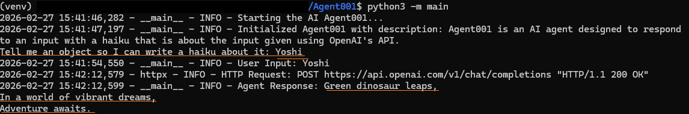

# AI Agent Project

Initial Agent001 built to use OpenAI.  This is a Python-based AI Agent using Microsoft Agent Framework with support for OpenAI models.  This takes in an input to create a Haiku.  Screenshot of expected result


## Project Structure

```
Agent001/
├── .vscode/
│   └── settings.json        # VS Code settings
├── agent.py                 # The Agent001 file that calls OpenAI
├── main.py                  # Initiates the application
├── .env.example             # Environment variables template
├── .gitignore               # Git ignore rules
├── pyproject.toml           # Python project configuration
├── requirements.txt         # Python dependencies
└── README.md                # This file
```

## Setup Instructions for Linux distro on Windows

### 1. Create and Activate Virtual Environment

``` bash
python3 -m venv venv
# On Linux:
source venv/bin/activate
```

### 2. Install Dependencies

```bash
pip install -r requirements.txt
```

### 3. Configure Environment Variables

```bash
# Copy the example file
cp .env.example .env

# Edit .env with your configuration
# Required: OPENAI for accessing GitHub-hosted models
```

### 4. Run the Agent

```bash
python3 -m src.main
```
